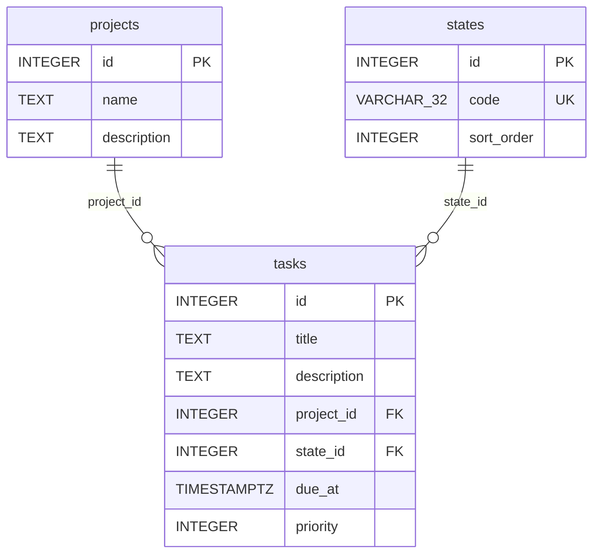

# Esquema de la base de datos

Este archivo describe la **estructura física** de la base: tablas, columnas,
tipos, nulabilidad, claves foráneas y restricciones con nombre. Se regenera con
la skill de proyecto `/describir-esquema`.

Fuente: los archivos de `alembic/versions/` leídos en orden de revisión (de la
raíz `down_revision = None` al head), contrastados con los modelos ORM de
`app/models.py`. Cuando modelos y migraciones difieren, manda la migración como
historial real del esquema y la diferencia queda anotada.

El comportamiento observable de la API (normalización de texto, reglas de
`due_at`, valores y orden del catálogo de estados, semántica de `priority`) vive
en [`docs/contrato-api.md`](contrato-api.md) y no se repite aquí.

## Historial de migraciones

| Orden | Revisión | Efecto sobre el esquema |
|---|---|---|
| 1 | `453c2e2272d5` | Crea `states` (vacía) con la restricción única `uq_states_code`. |
| 2 | `9f1c7b6a2d34` | Siembra el catálogo de `states` de forma idempotente (`ON CONFLICT (code) DO NOTHING`). No cambia estructura. |
| 3 | `3459cae2a91f` | Crea `projects`. |
| 4 | `26736e68b43a` | Crea `tasks` (v1): sin `due_at` ni `priority`. FKs `fk_tasks_project_id` y `fk_tasks_state_id`, ambas `ON DELETE RESTRICT`. |
| 5 | `c37bf9acde41` | Añade `tasks.due_at` (`TIMESTAMP WITH TIME ZONE`, `NULL`). |
| 6 | `10a391063f8e` | Añade `tasks.priority` (`INTEGER`, `NULL`) y la restricción `CHECK` `ck_tasks_priority_rango`. Es el head. |

## Parte 1 — Diagrama de tablas y relaciones

Notas que el `erDiagram` no expresa:

- **`tasks.project_id` → `projects.id`**: FK `fk_tasks_project_id`, `ON DELETE RESTRICT`.
- **`tasks.state_id` → `states.id`**: FK `fk_tasks_state_id`, `ON DELETE RESTRICT`.
- **`states.code`**: restricción única `uq_states_code`.
- **`tasks.priority`**: restricción `CHECK ck_tasks_priority_rango` = `priority IS NULL OR priority BETWEEN 1 AND 3`.
- **Sin índices explícitos.** Ninguna migración ejecuta `create_index`; sobre
  `tasks.project_id` y `tasks.state_id` solo existe la clave foránea, sin índice
  dedicado.
- Las cardinalidades del diagrama (`||--o{`) reflejan que cada tarea referencia
  obligatoriamente un proyecto y un estado (columnas `NOT NULL`); las
  migraciones no fijan un mínimo de tareas por proyecto o estado.

## Parte 2 — Diccionario de datos

### `states`

Creada por `453c2e2272d5`. Catálogo cerrado; el contenido lo siembra
`9f1c7b6a2d34`.

| nombre | tipo | ¿nulos? | significado |
|---|---|---|---|
| `id` | `INTEGER` | `NOT NULL` | Clave primaria. |
| `code` | `VARCHAR(32)` | `NOT NULL` | Código del estado. Único (`uq_states_code`). Valores y su orden en [contrato · Estados](contrato-api.md#estados). |
| `sort_order` | `INTEGER` | `NOT NULL` | "Campo de orden del catálogo" que usa `GET /states` para ordenar antes del desempate por `id`. Los valores sembrados (PENDIENTE=1, EN_CURSO=2, BLOQUEADA=3, HECHA=4) los fija la migración `9f1c7b6a2d34`. |

### `projects`

Creada por `3459cae2a91f`.

| nombre | tipo | ¿nulos? | significado |
|---|---|---|---|
| `id` | `INTEGER` | `NOT NULL` | Clave primaria. |
| `name` | `TEXT` | `NOT NULL` | Nombre del proyecto. Sin límite de longitud en la base. Normalización en [contrato · Normalización de texto](contrato-api.md#normalización-de-texto). |
| `description` | `TEXT` | `NULL` | Descripción libre del proyecto. |

### `tasks`

Creada por `26736e68b43a` (v1); ampliada por `c37bf9acde41` (`due_at`) y
`10a391063f8e` (`priority`).

| nombre | tipo | ¿nulos? | significado |
|---|---|---|---|
| `id` | `INTEGER` | `NOT NULL` | Clave primaria. |
| `title` | `TEXT` | `NOT NULL` | Título de la tarea. Sin límite de longitud en la base. Normalización en [contrato · Normalización de texto](contrato-api.md#normalización-de-texto). |
| `description` | `TEXT` | `NULL` | Descripción libre de la tarea. |
| `project_id` | `INTEGER` | `NOT NULL` | FK a `projects.id` (`fk_tasks_project_id`, `ON DELETE RESTRICT`): no se borra un proyecto con tareas. |
| `state_id` | `INTEGER` | `NOT NULL` | FK a `states.id` (`fk_tasks_state_id`, `ON DELETE RESTRICT`). |
| `due_at` | `TIMESTAMP WITH TIME ZONE` | `NULL` | Fecha límite. Añadida por `c37bf9acde41`; `NULL` en las tareas v1 previas. Reglas de zona y serialización en [contrato · Tareas v2: Fechas Límite](contrato-api.md#tareas-v2-fechas-límite). |
| `priority` | `INTEGER` | `NULL` | Prioridad. Añadida por `10a391063f8e`; `NULL` en las tareas previas. `CHECK ck_tasks_priority_rango` restringe a `NULL` o `1..3` en la base. Semántica en [contrato · Tareas v2: Prioridad](contrato-api.md#tareas-v2-prioridad). |

## Discrepancias entre `app/models.py` y las migraciones

Las migraciones son el historial real; estas diferencias quedan señaladas sin
corregirse (la skill solo describe).

- **`CHECK ck_tasks_priority_rango`**: existe en la base (migración
  `10a391063f8e`). El modelo `Task` declara `priority` como
  `mapped_column(Integer, nullable=True)` sin `__table_args__` ni
  `CheckConstraint`, así que no refleja esa restricción. El rango `1..3` a nivel
  de base solo lo garantiza la migración.
- **Nombre de la restricción única de `states.code`**: la migración la crea como
  `uq_states_code` (`UniqueConstraint(..., name=...)`); el modelo `State` usa
  `unique=True` en la columna, cuyo nombre de constraint lo genera SQLAlchemy y
  no tiene por qué coincidir. Es una diferencia de forma, no de estructura: en
  ambos casos `code` es único.
- **Sin discrepancias de columnas**: nombre, tipo y nulabilidad de las 13
  columnas coinciden entre `app/models.py` y el estado acumulado de las
  migraciones.
